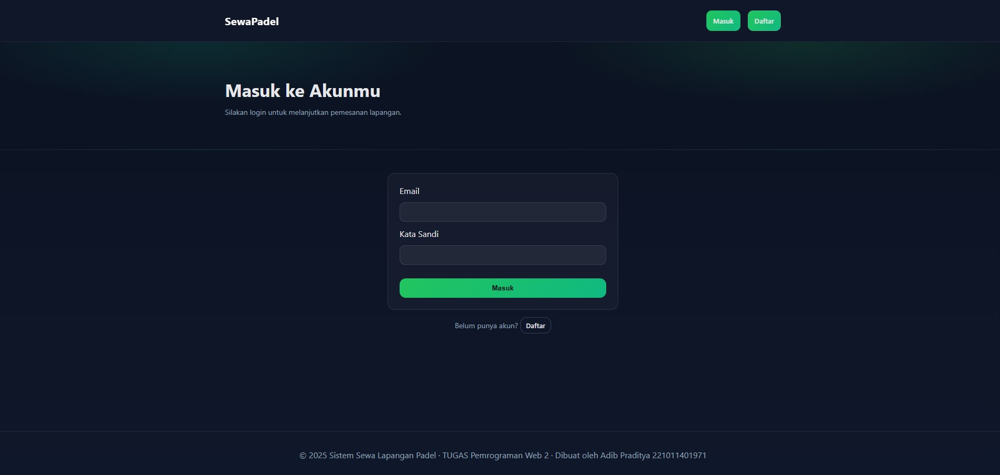
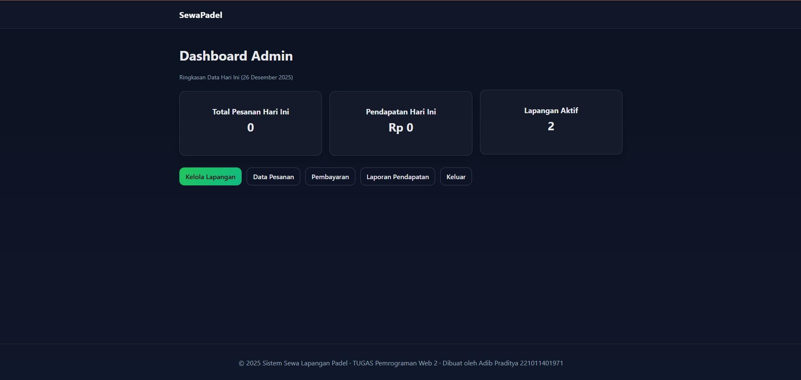
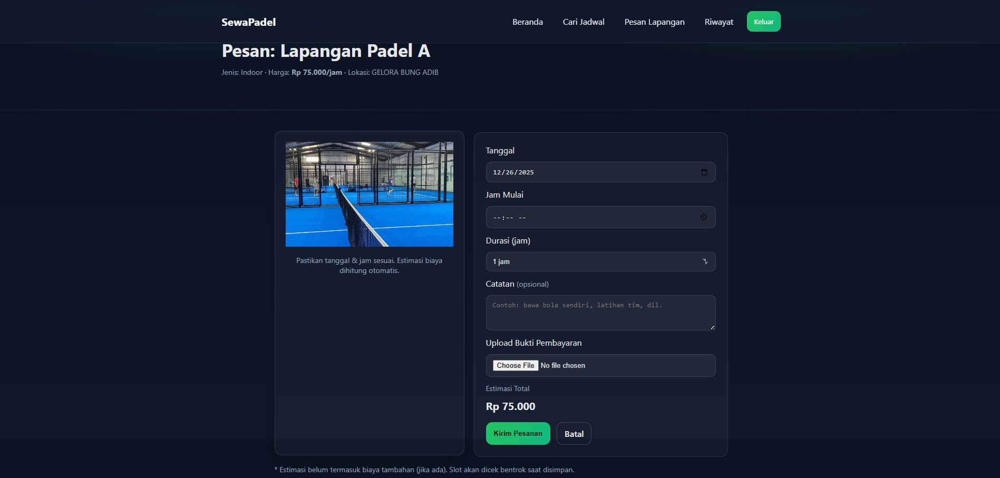
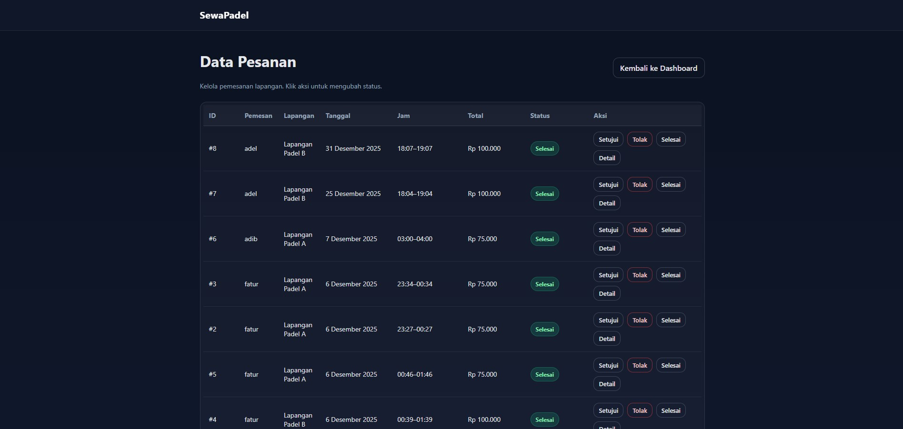

# Adib Praditya - 221011401971 - 07TPLP020

# 🏓 Sistem Informasi Penyewaan Lapangan Padel Berbasis Web

Sistem Informasi Penyewaan Lapangan Padel adalah aplikasi berbasis web yang digunakan untuk mengelola proses pemesanan lapangan padel secara online.  
Aplikasi ini dirancang untuk memudahkan **pengguna** dan **admin** dalam melakukan pengelolaan data lapangan, jadwal, pemesanan, serta laporan pembayaran secara terstruktur dan efisien.

Project ini dibangun menggunakan **PHP Native**, **MySQL**, dan **Bootstrap**, serta menerapkan konsep **multi-role user** (Admin, Pengguna).

---

## 📌 Fitur Utama

### 👤 Pengguna
- Registrasi dan login pengguna
- Melihat daftar lapangan padel
- Melihat jadwal ketersediaan lapangan
- Melakukan pemesanan lapangan
- Melakukan pembayaran
- Melihat riwayat pemesanan

### 🧑‍💼 Admin
- Login Admin
- Mengelola data lapangan
- Mengelola data pemesanan
- Mengelola jadwal lapangan
- Membantu verifikasi pemesanan

---

## 🧰 Teknologi yang Digunakan

- **Bahasa Pemrograman**: PHP (Native)
- **Database**: MySQL
- **Frontend**: HTML, CSS, Bootstrap
- **Backend**: PHP + PDO
- **Web Server**: Apache (XAMPP)
- **Database Port**: 3307

---

## 🖼️ Tampilan Aplikasi

### 🔐 Halaman Login
Halaman login digunakan oleh admin, petugas, dan pengguna untuk mengakses sistem sesuai dengan peran masing-masing.



---

### 📊 Dashboard Admin
Dashboard menampilkan ringkasan data seperti jumlah lapangan, jumlah pemesanan, dan total pengguna.



---

### 🏟️ Data Lapangan
Halaman ini digunakan untuk mengelola data lapangan padel, termasuk nama lapangan, harga, dan status ketersediaan.


---

### 📝 Pemesanan Lapangan
Pengguna dapat memilih lapangan dan jadwal yang tersedia untuk melakukan pemesanan.



---

### 📄 Laporan Penyewaan
Admin dapat melihat laporan penyewaan lapangan berdasarkan data pemesanan yang masuk.



---

## ⚙️ Konfigurasi Database

1. Jalankan **XAMPP**
2. Aktifkan **Apache** dan **MySQL**
3. Pastikan MySQL menggunakan **port 3307**
4. Buat database dengan nama:
   ```sql
   sewa_padel
5. Import file SQL:
      database/sewa_padel.sql
6. Konfigurasi koneksi database di:
      konfigurasi/koneksi.php

## ▶️ Cara Menjalankan Aplikasi

1. Clone repository ini:
      git clone https://github.com/username/sistem-sewa-padel.git
2. Pindahkan folder ke:
      htdocs/
3. Jalankan XAMPP
4. Akses aplikasi melalui browser:
      http://localhost/sistem-sewa-padel

## 🔐 Role & Hak Akses
. Role	Hak Akses
. Admin	Full akses sistem
. Pengguna	Booking & pembayaran

## 👨‍💻 Pengembang
Project ini dikembangkan sebagai tugas proyek / pembelajaran untuk menerapkan konsep:
   . CRUD
   . Multi-user authentication
   . Sistem informasi berbasis web
   . Manajemen database relasional

## 📄 Lisensi

Project ini dibuat untuk keperluan pembelajaran dan akademik.
Bebas digunakan dan dikembangkan kembali dengan menyertakan sumber.

